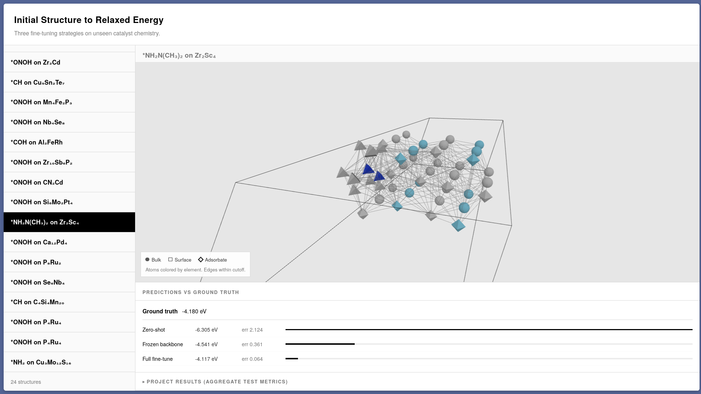
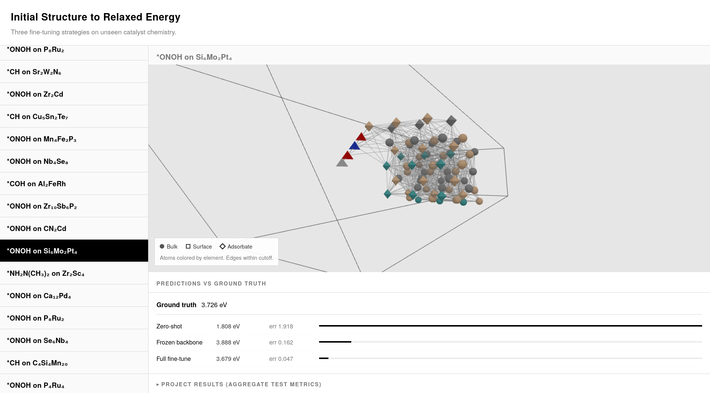

# Initial Structure to Relaxed Energy (IS2RE): Fine-Tuning a Pretrained Catalyst GNN


Fine-tuning a pretrained DimeNet++ graph neural network on unseen catalyst
chemistry from the Open Catalyst 2020 (OC20) dataset. The project measures how
much of a pretrained model transfers to out-of-distribution adsorbate and
catalyst combinations, and how much of the network must be retrained to recover
that performance.



## The Problem

Computational screening of catalysts requires estimating the relaxed adsorption
energy of a molecule on a surface. Doing this with density functional theory
(DFT) means running an expensive relaxation for every candidate material.
Machine learning surrogates trained on the OC20 dataset predict relaxed energies
directly from the initial structure, making large-scale screening feasible.

The practical difficulty is transfer. Models trained on a known set of catalysts
and adsorbates must generalize to combinations never seen during training. A
pretrained model encodes a great deal of chemistry, but its predictions on
out-of-distribution systems can still be far off.

## Goal

Compare three strategies on a held-out, out-of-distribution subset of OC20:

1. **Zero-shot**: evaluate the pretrained model without any fine-tuning.
2. **Frozen-backbone fine-tuning**: retrain only the output layers.
3. **Full fine-tuning**: retrain every parameter.

Report test MAE and energy-within-threshold (EwT) for each, and quantify how much
of the zero-shot performance gap is closed by retraining only a small fraction of
the network.

## Task

Initial Structure to Relaxed Energy (IS2RE) is one of the core tasks in the OC20
benchmark.

**Input**
- Atomic numbers for every atom in the system
- 3D positions of the initial (unrelaxed) structure
- Atom tags indicating bulk, surface, and adsorbate atoms
- Periodic cell information

**Output**
- A single scalar: the predicted relaxed adsorption energy (eV)

The model never sees a relaxation trajectory or intermediate structures. It
predicts the final relaxed energy directly from the initial geometry.

## Data

- **Source**: OC20 `val_ood_both` split (24,987 systems), where both the
  adsorbate and the catalyst are out of distribution relative to the pretraining
  set.
- **Subsample**: 11,000 systems, stratified by (adsorbate, catalyst) composition
  using the official `oc20_data_mapping.pkl`.
- **Split**: at the system level, so no structure appears in more than one split.
- Dataset released under CC-BY-4.0.

| Split | Systems |
|---|---|
| Train | 8,250 |
| Validation | 1,100 |
| Test | 1,650 |

## Method

### Base model

DimeNet++ pretrained on the OC20 100k relaxed-energy split (2,755,462
parameters). Energy outputs are normalized with the pretrained target statistics
(mean -1.526 eV, std 2.279 eV).

### Fine-tuning variants

- **Frozen backbone**: freeze the basis, embedding, and interaction blocks; train
  only the four output readout blocks (648,960 parameters, 23.5% of the network).
- **Full**: train all parameters.

Training details:

- Loss: MAE on normalized energies
- Optimizer: AdamW, weight decay 0
- Learning rate: linear warmup, then step decay (frozen: 1e-4; full: 3e-5)
- Model selection: early stopping (patience 8) on validation MAE
- Tracking: Weights & Biases project `is2re-finetune`

## Results

Evaluated on the held-out test split of 1,650 systems, never used during training
or model selection.

| Variant | Trainable params | Test MAE (eV) | Test EwT (0.02 eV) |
|---|---|---|---|
| Zero-shot | 0 / 2,755,462 | 0.6908 | 2.85% |
| Frozen-backbone | 648,960 / 2,755,462 | 0.5517 | 3.09% |
| Full | 2,755,462 / 2,755,462 | 0.5411 | 3.15% |

Fine-tuning reduces test MAE by 21.7% relative to zero-shot. Frozen-backbone
fine-tuning, retraining only 23.5% of the parameters, recovers most of the
improvement, and full fine-tuning adds a small further gain. EwT stays near 3%
for all variants: the 0.02 eV threshold is far tighter than the residual errors,
so it is dominated by the systematic energy-scale mismatch on out-of-distribution
systems.

## Web Demo

An interactive viewer over the held-out test set. A FastAPI backend serves
structures and per-structure predictions from the three checkpoints; a minimalist
single-page frontend renders each structure as a 3D molecular graph with
ground-truth and model predictions.



Run the backend (it also serves the frontend):

```bash
conda-env/bin/uvicorn app.main:app --host 0.0.0.0 --port 8000
```

Open the frontend:

```bash
xdg-open http://localhost:8000
```

The models are loaded once at startup, so the first start takes about a minute.
A Dockerfile for the backend is at `app/Dockerfile`.

API endpoints:

- `GET /health`
- `GET /structures`
- `GET /structures/{sid}`
- `GET /structures/{sid}/predictions`
- `GET /model-info`

## Technical Details

### Environment

- Python 3.11 (conda environment)
- fairchem-core 1.10.0 (last v1 release; required to load legacy OC20 checkpoints)
- torch 2.4.0 (CUDA 12.1), torch-geometric, torch-scatter, torch-sparse
- fastapi, uvicorn, pydantic for the web backend
- Three.js for the 3D viewer

### Reproduction

Run the full pipeline end-to-end:

```bash
bash scripts/run_experiments.sh
```

This downloads `val_ood_both`, builds the stratified system-level split, and runs
the zero-shot baseline, frozen-backbone and full fine-tunes, followed by held-out
test evaluation. Individual steps:

- `data/download_val_ood_both.sh` download and extract `val_ood_both`
- `data/make_subsample.py` stratified system-level split
- `scripts/run_zero_shot_eval.py` zero-shot baseline
- `scripts/run_finetune.py` fine-tune (frozen or full)
- `scripts/eval_test.py` held-out test evaluation

### Tests

```bash
conda-env/bin/python -m pytest app/tests -q
```

Integration test against the real models and artifacts (slow):

```bash
RUN_INTEGRATION=1 conda-env/bin/python -m pytest app/tests/test_integration.py -q
```

### Project structure

```
app/          FastAPI backend + interactive 3D web frontend
assets/       README figures
configs/      model and training configs
data/         download and preprocessing scripts
models/       model definitions and fine-tuning logic
scripts/      training, evaluation, and experiment orchestration
results/      final metrics and comparisons
```